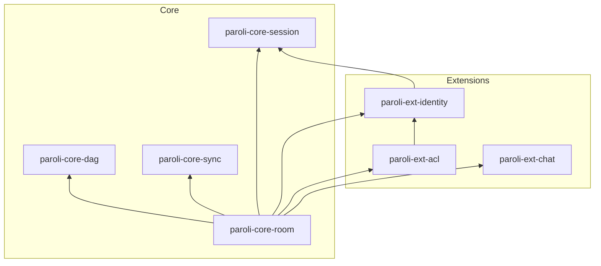

# Paroli
*The distributed chat protocol that doesn't hate you*

---

Paroli is an **opinionated**, **truly distributed**, **non-linear** chat protocol of many ambitions.

## What makes it different?

We hate complexity. That's why Paroli uses a simple append-only Merkle DAG inspired by Git to keep a decentralized timeline of a chat, over the Gossip protocol. Here is what Paroli aims to be:

- **Simple by design**: trusted technologies, hate complexity
- **Sovereign**: control over your data, redaction, privacy
- **Built to scale**: efficiency, resilience, distribution
- **Extensible**: easy integration of new features and protocols

Don't take our word for it, see it compared to Matrix:

| Protocol | Routing | Timeline / Conflict resolution | Event format | Networking model |
|-|-|-|-|-|
| Paroli | Gossip (Lightweight, stateless, lazy-loading) | Merkle DAG (Strict hash-of-hashes, 3-pass sync, minimalistic) | CBOR | Peer <-> Peer |
| Matrix | Full-mesh (Heavy, complex state-resolution) | Merkle DAG (State Resolution v2, very complex | JSON | Client <-> Server <-> Server <-> Client |

## But is it just for chat?

Absolutely not! As a matter of fact, [chat is a protocol extension](ext/paroli-ext-chat).

On a lower level, you could say that Paroli is a distributed database. Though chat is the main objective, the possibilities are limitless (distributed games, maybe?).

### Where do I start?

Check out the [paroli protocols](spec).

